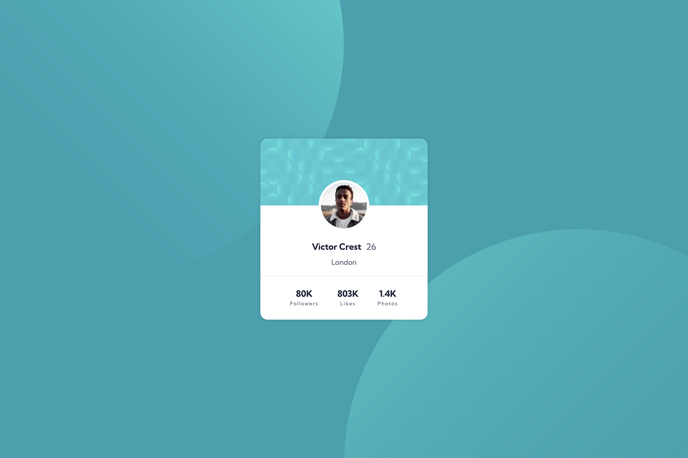

# Frontend Mentor - Profile card component solution

This is a solution to the [Profile card component challenge on Frontend Mentor](https://www.frontendmentor.io/challenges/profile-card-component-cfArpWshJ). Frontend Mentor challenges help you improve your coding skills by building realistic projects.

## Table of contents

- [Frontend Mentor - Profile card component solution](#frontend-mentor---profile-card-component-solution)
  - [Table of contents](#table-of-contents)
  - [Overview](#overview)
    - [The challenge](#the-challenge)
    - [Screenshot](#screenshot)
    - [Links](#links)
  - [My process](#my-process)
    - [Built with](#built-with)
  - [Author](#author)

## Overview

### The challenge

- Build out the project to the designs provided

### Screenshot

### Links

- Solution URL: [https://github.com/jamie-codeapp/fronend-mentor/tree/main/profile-card-component](https://github.com/jamie-codeapp/fronend-mentor/tree/main/profile-card-component)
- Live Site URL: [https://jamie-codeapp.github.io/fronend-mentor/profile-card-component/](https://jamie-codeapp.github.io/fronend-mentor/profile-card-component/)

## My process

### Built with

- Semantic HTML5 markup
- CSS custom properties
- Flexbox

## Author

- Website - [https://github.com/jamie-codeapp](https://github.com/jamie-codeapp)
- Frontend Mentor - [@jamie-codeapp](https://www.frontendmentor.io/profile/jamie-codeapp)
